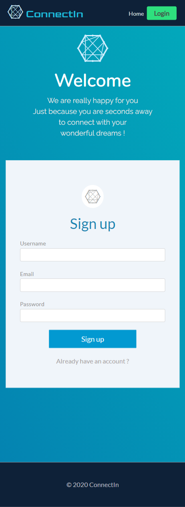

# ConnectIn

[](https://fathomless-stream-49781.herokuapp.com/)  
ConnectIn is a network, designed to connect your professional identity with opportunities.

# Description

:dart: ConnectIn is a RESTful API app, follows an MVC paradigm in its architectural structure.

Users can sign up safely to create a profile.  
User can search for a job using location and technologies or description.
Users can login to profile, and demonstrate their information, skills ,exprience,interests and background.  
Users can post any post, and leave comments.

## Table of Contents

- [Visuals](#Visuals)
- [Installation](#Installation)
- [Dependencies](#Dependencies)
- [Reach Us](#Reach-Us)
- [Contribution](#Contribution)
- [Test](#Test)

<!-- # Demo

:movie_camera:  


 -->

# Installation

:floppy_disk: To use this application for your own purposes: Clone the GitHub repository, and install all the dependencies, with`npm install`, </br>
on the integrated terminal install all the dependencies. </br>
Create your .env file and type in: `DB_NAME='jobedin_db' DB_USER='yourusername' DB_PW='yourpassword'` </br>
In the integrated terminal, seed `npm run seed` and start using `npm start` app will run at localhost3001. </br>

# Dependencies

:pushpin:

- express
- Express-session
- express-handlebars
- Sequelize
- Connect-session-sequelize
- mysql2
- Dotenv
- Bcrypt
- multer
- heroku
- Bootstrap
- Adzuna Job Api

# license


# Reach Us

[](https://github.com/Torabis)
[](https://github.com/rongbangye)
[](https://github.com/solomonmeresa)

## Contribution

Fork it to your github ,then you can make any changes with out affecting the main source code

Once you create your database then run those scripts to seed and run server in your terminal

```javascript
npm install
npm run start
```

## Visuals
### LARGE SCREEN SIZE


### SMALL SCREEN SIZE





### ©️2020 ConnectIn

<!-- MySQL Schema:

users
 - id *
 - email *
 - username *
 - password *
 - profile_pic *
 - type *


job_posts
- id *
- title *
- description *
- post_url *
- keywords *
- user_id *
- created_at
- updated_at


comments
- id *
- comment_text *
- user_id *
- post_id *
- created_at
- updated_at

likes
- id
- user_id
- post_id

profile
- id *
- firstname
- lastname
- skills *
- education *
- experience *
- industry
- interest
- user_id
-->
